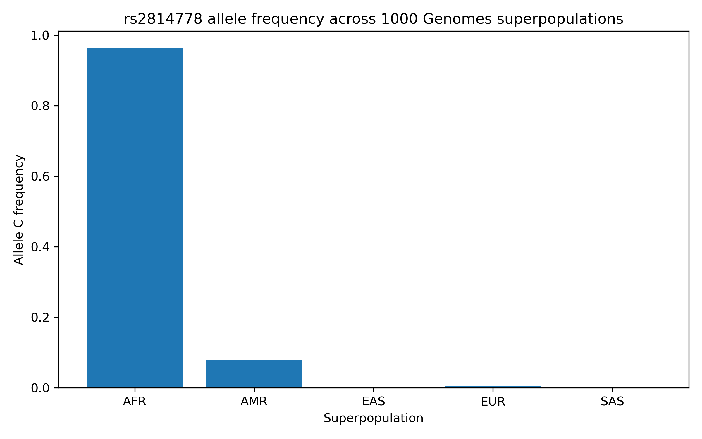
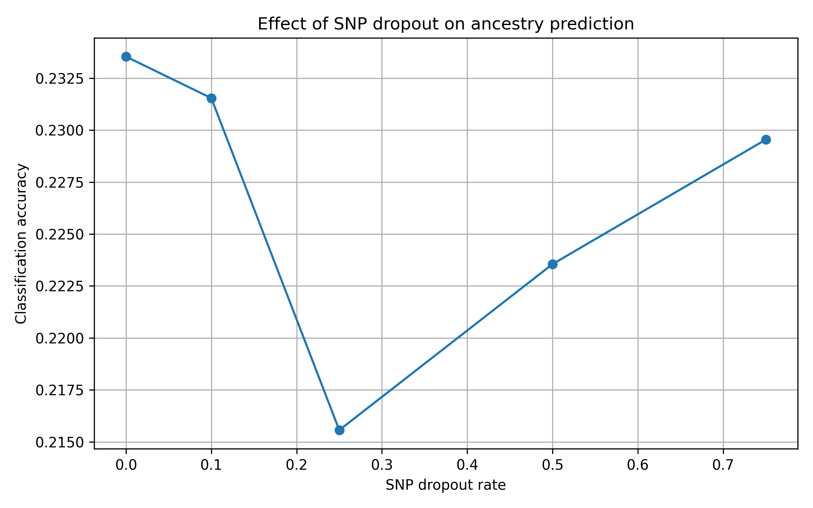

# Machine Learning and Population Genetics Benchmark for Forensic Ancestry Inference

[](https://doi.org/10.5281/zenodo.20643550)

Benchmarking machine learning and population genetics methods for forensic ancestry inference using ancestry-informative SNP markers and publicly available genomic datasets.

---

## Project Overview

This project evaluates the utility of ancestry-informative single nucleotide polymorphisms (AISNPs) for continental ancestry inference using publicly available population genetics datasets.

The study investigates:

* Population differentiation of individual AISNP markers
* Genotype frequency distributions across continental populations
* Population structure captured by a minimal AISNP panel
* Machine-learning-based ancestry classification
* The impact of SNP dropout on ancestry prediction performance

The project serves as a proof-of-concept benchmark for forensic ancestry inference using a small set of highly informative genetic markers.

---

## Project Highlights

✔ Analysis of 2,504 individuals from the 1000 Genomes Project

✔ Evaluation of ancestry-informative SNP markers

✔ Principal Component Analysis of population structure

✔ Comparison of four machine-learning classifiers

✔ Feature importance analysis

✔ SNP dropout robustness benchmarking

✔ Reproducible genomic data analysis workflow

✔ DOI-registered research benchmark

---

## Main Findings

### A minimal AISNP panel captures continental population structure

Even five ancestry-informative SNPs were sufficient to recover major continental population clusters.

### Strong ancestry classification performance

Machine-learning classifiers achieved approximately 91% accuracy despite the extremely small marker panel.

### rs2814778 is the most informative marker

Feature importance analysis identified rs2814778 (ACKR1/Duffy) as the strongest contributor to ancestry prediction.

### Classification remains robust despite SNP dropout

Prediction accuracy decreased gradually as markers were removed, demonstrating resilience to incomplete genetic profiles.

---

## Main Figures

### Population Differentiation at rs2814778



Genotype frequencies demonstrate strong population differentiation across continental populations.

---

### SNP Dropout Benchmark



Classification accuracy remains relatively stable despite progressive marker removal.

---

## Dataset

### Reference Population Dataset

**Source**

* 1000 Genomes Project Phase 3

### Continental Superpopulations

* AFR — African
* AMR — Admixed American
* EAS — East Asian
* EUR — European
* SAS — South Asian

### Total Samples

* 2,504 individuals

---

## Ancestry-Informative SNP Panel

| SNP | Gene / Region | Forensic Relevance |
|------|------|------|
| rs2814778 | ACKR1 (Duffy) | African ancestry marker |
| rs3827760 | EDAR | East Asian ancestry marker |
| rs1426654 | SLC24A5 | Pigmentation-associated AISNP |
| rs16891982 | SLC45A2 | European pigmentation marker |
| rs12913832 | HERC2/OCA2 | Eye pigmentation marker |

---

## Research Questions

This benchmark addresses several key questions:

1. Can a minimal AISNP panel capture continental population structure?
2. Which AISNPs contribute most strongly to ancestry classification?
3. How accurately can machine-learning models infer ancestry using only a few markers?
4. How robust is ancestry prediction under SNP dropout conditions?
5. Which classification algorithms perform best?

---

## Methods

### Data Processing

Genotype data were obtained from the 1000 Genomes Project Phase 3 release.

Target AISNPs were extracted from chromosome-specific VCF files and merged with population metadata.

### Population Frequency Analysis

Genotype frequencies were calculated across all continental populations.

### Principal Component Analysis

PCA was performed using numerically encoded genotypes from the five AISNP markers.

### Machine Learning Classification

Four supervised classifiers were evaluated:

* Support Vector Machine (SVM)
* Logistic Regression
* Random Forest
* Decision Tree

### Feature Importance Analysis

Random Forest feature importance scores were used to identify the most informative markers.

### SNP Dropout Benchmark

Progressive marker removal experiments simulated degraded forensic DNA profiles.

---

## Workflow

1. Download 1000 Genomes metadata
2. Extract AISNPs from VCF files
3. Generate genotype tables
4. Merge with population metadata
5. Calculate genotype frequencies
6. Perform PCA
7. Train machine-learning classifiers
8. Evaluate feature importance
9. Perform SNP dropout benchmarking
10. Compare model performance

---

## Results

### Machine Learning Performance

| Model | Accuracy |
|---------|---------:|
| SVM | 91.2% |
| Logistic Regression | 90.8% |
| Random Forest | 90.6% |
| Decision Tree | 90.2% |

The Support Vector Machine achieved the highest classification accuracy.

---

### Principal Component Analysis

* PC1 explained 52.7% of variance
* PC2 explained 27.6% of variance
* Combined variance explained: 80.3%

PCA successfully separated major continental populations despite the minimal marker panel.

---

### Feature Importance

| SNP | Importance |
|------|---------:|
| rs2814778 | 0.315 |
| rs16891982 | 0.226 |
| rs3827760 | 0.216 |
| rs1426654 | 0.172 |
| rs12913832 | 0.072 |

rs2814778 was identified as the most informative marker.

---

## Scientific Significance

Ancestry inference remains an important component of:

* Forensic genetics
* Population genomics
* Human genetic diversity research
* Genetic epidemiology

This benchmark demonstrates that a highly reduced AISNP panel can still recover substantial population structure and support robust ancestry prediction.

---

## Skills Demonstrated

### Population Genetics

* Population structure analysis
* AISNP evaluation
* Genotype frequency analysis
* Continental ancestry inference
* Forensic genetics workflows

### Machine Learning

* Random Forest
* Support Vector Machine
* Logistic Regression
* Decision Trees
* Cross-validation
* Model benchmarking
* Feature importance analysis

### Bioinformatics

* VCF processing
* Genomic data analysis
* PCA
* Population-scale datasets
* Reproducible computational workflows

---

## Repository Structure

```text
data/
metadata/
results/
scripts/
manuscript/
```

---

## Reproducibility

```bash
git clone https://github.com/ag48665/forensic-ancestry-benchmark

cd forensic-ancestry-benchmark

pip install -r requirements.txt
```

### Core Benchmark Scripts

* scripts/26_rf_5snp.py
* scripts/32_logistic_regression_5snp.py
* scripts/33_decision_tree_5snp.py
* scripts/37_svm_5snp.py
* scripts/35_rf_cross_validation.py
* scripts/36_cv_model_comparison.py

---

## Limitations

* Only five AISNP markers were evaluated
* Continental ancestry was assessed at a broad population level
* Admixed populations remain more challenging to classify
* Additional markers would improve resolution
* Independent validation cohorts would strengthen conclusions

---

## Future Work

* Expansion to the Kidd 55 AISNP panel
* XGBoost benchmarking
* Ensemble learning approaches
* Forensic DNA degradation simulations
* Independent population validation datasets
* Fine-scale ancestry inference

---

## Citation

If you use this benchmark, please cite:

**Gabara, A. (2026).**

*Forensic Ancestry Benchmark: Verified 5-SNP benchmark against 1000 Genomes VCF files.*

Zenodo.

https://doi.org/10.5281/zenodo.20643550

---

## DOI

https://doi.org/10.5281/zenodo.20643550

---

## License

MIT License

---

## Author

**Agata Gabara**

Incoming MSc Bioinformatics Student

Research Interests:

* Computational Biology
* Population Genetics
* Cancer Genomics
* Machine Learning for Genomics
* Single-Cell Transcriptomics

GitHub: https://github.com/ag48665

LinkedIn: https://www.linkedin.com/in/agatha-gabara-06494a37/
