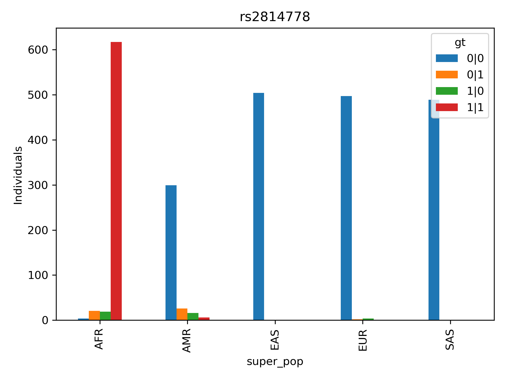
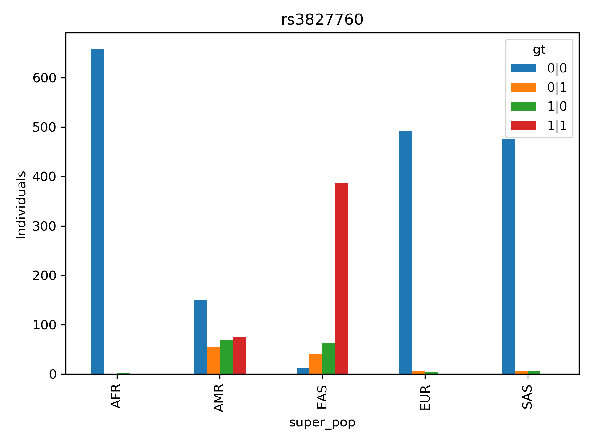

# Forensic Ancestry Benchmark

Benchmarking forensic ancestry inference using ancestry-informative SNPs (AISNPs), population genetics, and machine learning approaches.

---

## Overview

This project investigates the utility of ancestry-informative SNPs (AISNPs) for forensic ancestry inference using publicly available population genetics datasets.

The benchmark focuses on:

* Population differentiation of individual AISNP markers
* Genotype frequency distributions across continental populations
* Effects of SNP dropout on ancestry prediction
* Robustness of ancestry inference under degraded forensic DNA conditions

---

## Dataset

### Reference Population Dataset

Source:

* 1000 Genomes Project Phase 3

Superpopulations:

* AFR — African
* AMR — Admixed American
* EAS — East Asian
* EUR — European
* SAS — South Asian

Total individuals:

* 2504 reference samples

---

### Ancestry Informative SNPs

The current benchmark includes five widely studied AISNPs.

| SNP | Gene / Region | Forensic relevance |
|------|------|------|
| rs2814778 | ACKR1 (Duffy) | African ancestry marker |
| rs3827760 | EDAR | East Asian ancestry marker |
| rs1426654 | SLC24A5 | Pigmentation-associated AISNP |
| rs16891982 | SLC45A2 | European pigmentation marker |
| rs12913832 | HERC2/OCA2 | Eye pigmentation marker |

---

## Workflow

1. Download and validate 1000 Genomes metadata
2. Extract target SNPs from chromosome VCF files
3. Generate genotype tables
4. Merge genotypes with population metadata
5. Calculate genotype frequencies
6. Visualize population distributions
7. Evaluate ancestry classification robustness

---

## Key Findings

* Five real AISNPs were extracted from the 1000 Genomes reference dataset.
* All markers demonstrated substantial continental population stratification.
* rs2814778 showed strong African specificity.
* rs3827760 showed strong East Asian enrichment.
* rs16891982 showed strong European enrichment.
* Multi-marker AISNP panels provide substantially greater ancestry information than individual loci.

---
### Principal Component Analysis

Principal Component Analysis (PCA) was performed using genotypes from five ancestry-informative SNPs.

The first principal component explained 52.7% of the total variance, while the second principal component explained 27.6%, accounting for 80.3% of the overall genetic variation.

Distinct clustering patterns were observed across continental populations. African samples formed a separate cluster, whereas East Asian populations were primarily separated along the second principal component. European populations occupied a distinct region of the PCA space, while Admixed American populations displayed broader dispersion consistent with mixed continental ancestry.

These findings demonstrate that even a small AISNP panel captures substantial population structure within the 1000 Genomes reference dataset.

---
### Feature Importance Analysis

Random Forest feature importance analysis identified rs2814778 as the most informative marker for continental ancestry classification (importance = 0.315).

The second and third most important markers were rs16891982 (0.226) and rs3827760 (0.216), both of which are known to exhibit substantial population differentiation between continental groups.

The pigmentation-associated variants rs1426654 (0.172) and rs12913832 (0.072) contributed additional discriminatory information but showed lower importance scores.

Overall, the importance ranking was consistent with established forensic genetics literature and reflected the known ancestry informativeness of these loci.

---
## Figures

Figure 1. Population-specific genotype frequencies for the five AISNP markers.

Figure 2. Principal Component Analysis of five AISNP markers.

Figure 3. Random Forest confusion matrix.

Figure 4. Classification accuracy as a function of SNP dropout.

Figure 5. Feature importance scores estimated by Random Forest.

Figure 6. Comparison of machine-learning classifier performance.

---
## Tables

Table 1. Summary of machine-learning classifier performance.

| Model | Accuracy |
|---------|---------:|
| SVM | 91.2% |
| Logistic Regression | 90.8% |
| Random Forest | 90.6% |
| Decision Tree | 90.2% |

---
## Limitations

The present study evaluated only five ancestry-informative SNPs from the Kidd AISNP panel. Although high continental classification accuracy was achieved, additional markers would likely improve performance, particularly for admixed populations.

Future work should evaluate the complete Kidd 55 AISNP panel and assess robustness under simulated DNA degradation scenarios representative of forensic casework.

---

## Results

### Population Distribution of Ancestry-Informative SNPs

Five ancestry-informative SNPs were extracted from the 1000 Genomes Phase 3 dataset and evaluated across five continental superpopulations (AFR, AMR, EAS, EUR, and SAS).

The rs2814778 variant demonstrated strong African specificity. Homozygous alternative genotypes were observed predominantly in AFR individuals and were nearly absent in EUR, EAS, and SAS populations.

The rs3827760 marker showed strong enrichment of alternative genotypes in East Asian populations.

The rs1426654 marker displayed substantial population differentiation across continental groups.

The rs16891982 marker exhibited strong enrichment within European populations.

The rs12913832 variant also showed marked population differentiation, with elevated frequencies of alternative genotypes in European populations.

Together, these findings confirm that a small AISNP panel captures substantial continental population structure within the 1000 Genomes reference dataset.

---

## Example Figures

### rs2814778 (ACKR1)



### rs3827760 (EDAR)



---

## Population Stratification

All five AISNPs demonstrated substantial differences in genotype frequencies across continental populations.

Examples:

* rs2814778 strongly differentiates African populations.
* rs3827760 strongly differentiates East Asian populations.
* rs16891982 shows strong European enrichment.
* Multiple AISNPs provide complementary ancestry information.

---
### Support Vector Machine Performance

A linear Support Vector Machine (SVM) classifier was evaluated using the same five ancestry-informative SNPs.

The SVM model achieved the highest classification accuracy among all tested machine-learning approaches, reaching 91.2% accuracy on the held-out test dataset.

Population-specific performance remained high for African, East Asian, European, and South Asian populations, while Admixed American populations showed reduced classification performance, consistent with previous analyses.

The superior performance of the SVM classifier suggests that ancestry differentiation captured by the selected AISNP panel is largely linearly separable in feature space.

These results demonstrate that even a minimal five-marker ancestry panel can provide robust continental ancestry prediction when combined with appropriate machine-learning algorithms.

---

## SNP Dropout Experiment

Random Forest ancestry classification was evaluated under simulated SNP dropout conditions.

Classification performance remained relatively stable across increasing dropout levels, demonstrating the challenges of ancestry prediction using limited marker sets.

---

## Conclusions

A small panel of five ancestry-informative SNPs successfully reproduced known continental population structure in the 1000 Genomes dataset.

The results validate the analytical workflow and support further development of machine-learning-based forensic ancestry prediction models using larger AISNP panels and degraded genotype profiles.

---

## Repository Structure

```text
data/
metadata/
results/
scripts/
manuscript/
```

---

## Generated Outputs

### Population Tables

* rs2814778_by_population.tsv
* rs3827760_by_population.tsv
* rs1426654_by_population.tsv
* rs16891982_by_population.tsv
* rs12913832_by_population.tsv

### Summary Table

* all_snp_population_genotype_counts.tsv

### Figures

* rs2814778.png
* rs3827760.png
* rs1426654.png
* rs16891982.png
* rs12913832.png

---
## Figure Captions

Figure 1. Principal Component Analysis (PCA) of five ancestry-informative SNPs across 2504 individuals from the 1000 Genomes Project.

Figure 2. Random Forest feature importance ranking for five ancestry-informative SNPs.

Figure 3. Confusion matrix of Random Forest ancestry classification.

Figure 4. Classification accuracy under progressive SNP dropout conditions.

Figure 5. Genotype distribution of rs2814778 across continental populations.

Figure 6. Genotype distribution of rs3827760 across continental populations.

Figure 7. Genotype distribution of rs1426654 across continental populations.

Figure 8. Genotype distribution of rs16891982 across continental populations.

Figure 9. Genotype distribution of rs12913832 across continental populations.

---
## Future Work

* Principal Component Analysis (PCA)
* Random Forest ancestry classification
* XGBoost ancestry classification
* SNP dropout benchmarking
* Comparison with published forensic AISNP panels
* Validation using additional public datasets

---
## References

1000 Genomes Project Consortium. A global reference for human genetic variation. Nature. 2015.

Kidd KK, Speed WC, Pakstis AJ et al. Progress toward an efficient panel of SNPs for ancestry inference. Forensic Science International: Genetics. 2014.

Phillips C. Forensic genetic analysis of bio-geographical ancestry. Forensic Science International: Genetics. 2015.

Jobling MA, Gill P. Encoded evidence: DNA in forensic analysis. Nature Reviews Genetics. 2004.
---

## Author

**Agata Gabara**

Independent Researcher

---

## License

MIT License
